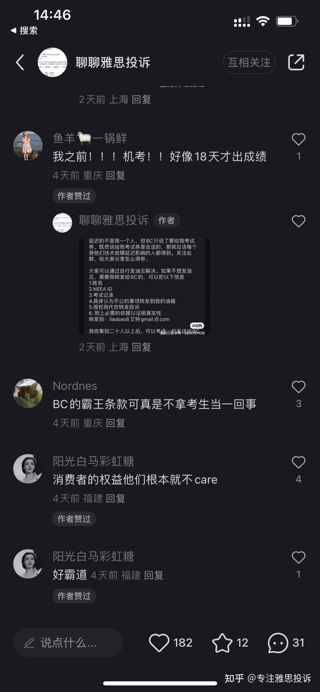

# The release of IELTS computer-based test results has been delayed, affecting hundreds of thousands of people! After complaining to the senior management of the organizer, the British Council, the officials tried to get me to sign a coupon to keep it a secret!

If you'd like to read Chinese language version, please click here:
https://zhuanlan.zhihu.com/p/662803637
  
## Background
### What's IELTS
On the official website(https://takeielts.britishcouncil.org/take-ielts/what-ielts):

IELTS in its full form stands for the International English Language Testing System – an English Language proficiency test developed and run by the British Council in partnership with IDP Education and Cambridge Assessment English.

The IELTS system is highly regarded and widely recognised as the world’s most popular English language proficiency test for higher education and global migration. Whether you are looking to study, develop your career, or settle in an English-speaking country, IELTS can pave the way. 

### What Happened this Year about the IELTS?

I took the IELTS computer-based test in August 2023, and then received a text message notification from the organizer BC Education Consulting (Beijing) Co., Ltd. (hereinafter referred to as BC) that the results were delayed. Before registering, I browsed the BC official website and found that its official website advertised that the IELTS computer-based test results would be available 3 days after the test, so I chose to register for the IELTS computer-based test. The actual situation is that the results are not announced until 10 days after the exam, which is seriously inconsistent with the publicity on its official website. suspected of violating the law.

After further investigation, I found that there is not only me but also many other people are influenced by their system failure.

## Impact Of the Incident

Preliminary investigation shows that this incident is not an isolated case, nor is it a single examination room. The delay in test results involves multiple countries and lasts for dozens of days. Calculated based on the number of IELTS computer-based test centers and the popularity of registration (even in a test center with a small number of candidates, more than 10 people will participate in an exam. The entire summer is a hot season for IELTS registration, and most of the sessions are full). Delays in the release of computer-based test results caused by the organizer's system failure can affect hundreds of thousands to millions of people (conservative estimates).
 

 

 

 

 

 

 

 

## The British Council's Attitude
### A large number of complaints were dismissed without substantial compensation.
 

 

### When the email arrived at the executive office, the final solution was to compensate for an exam coupon (waiving the registration fee of 2,170 yuan), but it required signing a confidentiality agreement and giving up prosecution.

The process is relatively tortuous and complicated:

#### 1. The deputy director of examination business quoted inappropriate terms

After the complaint was made to Nick Godfrey, the then Director of Examinations in China, he handed the matter over to Nathan Hu (Hu Yang), Deputy Director of Examination Business. The deputy director initially expressed his apologies and thanked me for my suggestions. He said that they had changed the inappropriate expression, but quoted the clause stating that they could not compensate:

Nathan HU wrote:
"
Thank you for getting in touch. I have thoroughly reviewed your case, and I feel sorry for not delivering the highest quality of service. I also apologize for any inconvenience we may have caused you during your journey with us.

 

I highly appreciate your constructive feedback on how we can improve the customer experience. I'm pleased to inform you that we have taken action based on your feedback to enhance the WeChat mini-program text. You should notice the difference the next time you book your speaking test, and I hope you'll find it clearer and more user-friendly.

 

I sincerely apologize for the delay in releasing your IELTS scores, and I understand the inconvenience this may have caused you. The IELTS administrator has made every effort to expedite result delivery and has provided assistance to candidates upon request to the best of our abilities. I can personally empathize with the stress you've experienced recently while managing all the uncertainties in result timelines. I'm pleased to find out that your scores were made available on September 1st, and I hope they are satisfactory for you.

 

That said, please note that the IELTS administrator cannot accept liability for the extended result processing time, as explained in the candidate rules: 'Your result may not be issued on time after the test if the IELTS Test Partners decide that it is necessary to review any matter associated with your test or the administration of your test.' But I will be more than happy to provide you with further assistance as far as possible. Please don't hesitate to reach out if I can be of help.

 

I appreciate your understanding and patience during this time and look forward to the opportunity to provide you with a smoother test experience if you choose to use our services again in the future.
"
 

I wrote: "
If you cannot guarantee the release time of the scores, please refrain from using such misleading advertisements on your website, as they have and will continue to confuse customers.

Furthermore, my intention is not to assist you in improving your service quality. I am expressing my dissatisfaction with the service I received. However, considering that you have improved your service quality based on my feedback, you should provide me with corresponding coupons for the exam or reimburse me for the associated IELTS exam fees. Here’s my reasons:

Even if you have an agreement, you should not display advertisements that mislead consumers. 

Even if you do not believe you need to reimburse me for the delay in score release, you should not announce the exam time after your initial promise. 

So where is your commitment?

I did not intend to provide free advice. 

If you go to Starbucks and buy a cup of coffee and you are not satisfied, the merchant will make a new cup for you, even if they have provided the service they deserve.

But if you are participating in the IELTS test, even if the official does not provide the promised service, it will only verbally apologize, and then the consequences of the official error will be borne by the person who paid.

Is that so?"

And Nathan wrote back:"
I regret that our customers had to wait longer than usual for their scores, and I can imagine the anxiety and stress you may have experienced. As I explained, this delay was communicated in the Candidate Rules. While we strive to provide the highest quality of service, the British Council cannot accept liability for extended result processing times.

 

Having said that, as a token of our appreciation for your feedback on our WeChat Mini Programme service, I would be delighted to offer you a complimentary copy of the "IELTS Official Guide," valued at CNY168 (https://www.chinaielts.org/guide/official_guide.shtml). I hope you will find it valuable for your future IELTS preparation or general English studies. If you could kindly provide me with your mailing address in Chinese, I will arrange for it to be sent to you tomorrow.

 

Once again, I appreciate your understanding and trust in IELTS.
"
 

In my mind: I spent 2,170 yuan on a service, but you failed to deliver as promised. You gave me a book that I can’t use, and the original price is not even a fraction of the price. How can I accept this... Besides, even according to the exam terms According to the terms, I only agreed to accept the delay caused by you randomly checking my scores. It did not mention that I, a candidate who spent money, would be responsible for the mistakes you made! So I continued to send emails to Nathan Hu (Hu Yang), and these emails were also copied to director Nick Godfrey:
"Hey Nathan Hu,

Even as you said, 

 "the candidate rules: 'Your result may not be issued on time after the test if the IELTS Test Partners decide that it is necessary to review any matter associated with your test or the administration of your test.' But I will be more than happy to provide you with further assistance as far as possible. Please don't hesitate to reach out if I can be of help."

This is only for the "review" results, not for the technical problems that troubled me, and this technical failure was not caused by me, but by your own system.

And your advertisement and admission ticket clearly indicate the time when the results will be released.

That said, it is only the first problem that I have pointed out. The second problem is with the WeChat mini-program. I am telling you about this problem not because I want you to improve it. It’s my evidence to request a refund.

The terms and conditions say that you cannot compensate me for delays in the release of scores due to review of scores, and I have never asked you to compensate me based on that.

You caused the delay due to a system failure rather than reviewing the results. I certainly cannot pay for your system failure.

And the fact that the exam time is later than promised is enough to require you to reschedule the exam for me free of charge.

Be decent. Pay me money or give me exam vouchers.   
"

#### 3. For the first time, BC offered to compensate for exam vouchers and signed a settlement agreement requesting confidentiality and dropping the lawsuit.

I didn’t receive a reply to the email after that, so I sent another email to director Nick Godfrey, saying that what Nathan Hu (Hu Yang) did was really insincere and very dishonorable. Nick Godfrey said he would take another look. A few days later, I received a call from the customer service manager of BC, the IELTS organizer, telling me that although she was on holiday and off work, she would rather deal with my problem during non-working hours. They admitted that it was their own mistake. They said they could compensate me with an exam coupon, but asked me to sign a settlement agreement. I expressly rejected such a solution and forwarded the relevant provisions of the Consumer Protection Act cited to Nick Godfrey. And he said:

“I have reviewed the details of your case and I consider our offer to be appropriate given the circumstances and inconvenience you have faced.

I am sorry that our service did not meet your expectations on this occasion, but I feel that the response from our customer service team has been reasonable and proportionate.”

#### 4. The deputy director of BC sent a formal "settlement agreement."

A few days later, Nathan Hu once again (deliberately) misinterpreted my meaning and sent me the "Settlement Agreement":

 

And here is the translation:

"To ensure that both parties fully understand the agreement, please sign the attached agreement and return two copies to the address below. We will sign and stamp your returned copy and send you the original. I will provide you with an exam voucher upon receipt of your return agreement. If you are inconvenient to print it, you can inform our office and we can provide it to you by mail, but this will take more time than the previous method.

Receiving address: British Council Zhang Weishou, 4th Floor, Tower 1, Liangmahe Office Building, No. 8 Dongsanhuan North Road, Chaoyang District, Beijing Zhang Weishou 010-85919000

Please also provide your detailed email address so that we can send you the agreement and the "IELTS Official Guide".

Thank you again for your cooperation."

The agreement is below: 

 

And here is the translation:

"
settlement agreement
Party A: BC Education Consulting (Beijing) Co., Ltd.
Address: 3rd Floor, Building 4, No. 8 Dongsanhuan North Road, Chaoyang District, Beijing
Party B:
ID number:
address:
contact number:
Whereas:
1. Party A cooperates with the Education Examination Authority of the Ministry of Education to operate the IELTS test in mainland China;
2. Party B signed up to take the computer-based IELTS test of Shanghai Normal University on August 22;
3. IELTS computer-based test results are usually announced 3-5 days after the test, but due to system reasons, Party B’s test results are delayed until
Published September 1, 2023;
4. Party B believes that the delayed release of results has had a negative impact on it; 
Regarding the delay in the announcement of the above-mentioned results, Party A and Party B have now voluntarily reached a settlement agreement as follows (hereinafter referred to as the "Agreement") through friendly negotiation:

I. Party A will issue an IELTS test coupon to Party B within 3 working days after receiving this agreement signed by Party B. The test coupon is valid for 180 days from the date of issuance;

II. Party B promises not to file a lawsuit, initiate a complaint, or claim any compensation in any other way against Party A, the IELTS test partners, and the Education Examination Authority of the Ministry of Education (hereinafter collectively referred to as the "IELTS related parties") regarding the delay in the release of scores mentioned above. compensation or other rights;

III. Party B declares and undertakes that: regarding matters related to the settlement between the parties, including but not limited to any information learned from Party A during the settlement process, the content of this settlement agreement and subsequent handling matters (hereinafter referred to as "confidential information"), It shall be kept strictly confidential and confidential information shall not be disclosed to any third party. Party B further makes an irrevocable commitment: it will not exchange confidential information with any other third party in any form (including verbally, online, etc.) or delay the release of this result. Otherwise, Party A has the right to require Party B to pay liquidated damages of RMB 20,000. 

IV. This agreement will be the complete and final settlement plan between Party B and IELTS related parties regarding this incident and all other matters that have occurred or may be directly or indirectly related to the delay in the release of results.

V. Both parties agree that if any party to this Agreement fails to properly perform this Agreement, the breaching party shall be responsible for all losses, damages, obligations, and expenses that are directly or indirectly caused or may be caused or caused by the breach of any terms of this Agreement or caused to the non-breaching party. or expenses (including attorney’s fees) shall be compensated to the non-breaching party.
6. Both parties agree to submit disputes arising from this settlement agreement to the People's Court of Chaoyang District, Beijing for resolution.
7. This agreement shall take effect from the date when Party A seals it and Party B signs and seals it. It is made in two copies, each party holds one copy, and has the same legal effect.
[No text after this]
Party A (seal): BC Education Consulting (Beijing) Co., Ltd.
Date: year month day
Party B (signature, seal):
Date: year month day
"

#### 5. Continue to Complain to the British Council Headquarters Executives and Receive Threats"

At this point, I couldn't bear it anymore and complained about this incident to BC's global executives. Relevant past emails are also attached. The senior management sent an employee from the Middle East to assist with the process. During this period, I also received a call from Nathan Hu (although I did not explicitly authorize Hu Yang to call me because I had clearly stated too disgusted with him). When asked about Hu Yang's title during the call, Hu Yang did not disclose it directly. He only told me that he was the person in charge of the customer service center and left me a contact information where I could not reach him at all.

After several days, I received an email: 

 

And the translation is here: 
"
Our company has received many complaints from you about the release date of IELTS test results. We understand that you attach great importance to this matter, but we must emphasize the following two points:

1. About our company’s complaint handling process

Our company has a complete complaint handling procedure. Our company has accepted your complaint and the procedure has been started. Our relevant personnel have contacted you many times before and proposed solutions. However, you are not satisfied with the solutions proposed by our company. Not satisfied. In this regard, our company is conducting further processing in accordance with relevant procedures. We recommend that you wait patiently.

2. Regarding your complaint

As mentioned above, our company has conducted multiple rounds of communication regarding your complaint. At present, our company's internal position on this issue is relatively clear and consistent. We believe that the solution we proposed is reasonable and fair. Your use of other methods, such as sending emails to the email addresses of our executives, threatening to expose the matter online, and making repeated complaints against relevant staff of our company, will not actually help both parties resolve the matter in a positive and rational manner. We object to any form of insult, threat, or interference with the normal work of our staff during your complaint or communication process. We ask that you remain respectful and reasonable when interacting with our staff. 

In addition, your behavior of threatening to expose this matter online with the intention of coercing our company to accept your proposed solution may be illegal. If it infringes upon our reasonable rights and interests, our company reserves the right to take further measures to pursue your legal liability.

Finally, our company once again emphasizes that we hope to resolve your complaint in a rational and compliant manner. If you have any other questions or concerns, please contact us at this email!
 
All the best. 

British Council
"

And I wrote back:
"
1.
I'm not threatening you, it's my right to be exposed. You want to say I broke the law, please tell me which law I broke?

Do you not allow the media to know what you do? So what’s the use of the media? Where is the violation?

You are trying to make me sign a contract giving up my legal rights. There is a legal basis for compensation. Are you legal?

Who is suspected of breaking the law? Have you not violated the Consumer Rights Protection Law and the Advertising Law?

Please don't confuse black and white.

2.
What is my intention? My intentions are all based on the Consumer Rights Protection Act. You mean I don't have the right to tell anyone else about this? Who are you threatening?
I reserve the right to take further measures to pursue your company's legal liability.

3. 
Your deputy director of examination business, Hu Yang, promised to give a reply by yesterday at the latest. Why didn’t he give it yesterday?
If you can't fulfill your promise, do you have professional ethics? Please give me an explanation.

4.
You also suggested that I wait patiently. How long have I been waiting patiently? Where is your promise? Are you allowed to unilaterally distort my meaning, force me to give up my rights, and not allow me to declare my rights? Is my assertion of my rights a threat? Who gave you the qualifications to allow you to talk nonsense like this?

5.
When I called the phone number given by your deputy director Hu Yang, they said that transfer was not supported at all, so you just lied like that? Do you allow people like your deputy director Hu Yang to call me at will? When I asked for a phone number, I couldn't even give him any contact information to contact him. Why did he give me a fake one?

They are all people who understand the law, who are you trying to scare?

6.
Show some respect to your customers. It’s you who don’t keep your promise, it’s you who violates my rights, it’s you who says you want to thank me, it’s you who says you want to rebuild trust with me.

Have you compensated for my legal claims? Have the promises been fulfilled?

Where do you get the confidence to speak in this tone here? So confident.

7.
You must have a basis for what you say. Which specific actions and words of mine made you feel insulted or threatened, and which laws were violated? Tell me clearly.

I have a legal basis to seek compensation from you. Did I lie?

I advise you not to insult or threaten your customers.

For example, I am making a claim, but you insist on saying that I am making suggestions and ignore my claim. If you are trying to send a book to replace your legitimate obligation to pay compensation, I think it is an insult to avoid the important and trivial - as if I have spent so much time and you can send people away with just one book.

For example, if you don't keep your promise and never give me a reply when you say you will, and at the same time you say you will work hard to rebuild trust with me, then such contradictory words and deeds are also an insult to the trust and expectations of customers.

As for me saying that I reserve the right to resort to law and the media, that is of course my right. Tell me what is suspected of being illegal and what obligation I have to keep it confidential. Or do you think that if some of your practices were exposed, it would be very detrimental to you? Can't stand everyone's criticism?

Oh, by the way, I can also say polite words: I understand some of your interesting psychology, and I wish you all the best!

8.
"If you have any additional questions or concerns, please contact us at this email!"

I’ve asked so many questions, and you’ve all been working all day, but you haven’t answered any of them.

Then ask another question:

I found this on the China Judgment Documents Network. Is this your company?

9.
"Our company has a complete complaint handling procedure"

As for whether your company has a complete complaint handling procedure, you can find out by searching on Weibo, Xiaohongshu and other places.

Seeing that you speak so confidently, it reminds me of an example: If someone insists on saying that Yao Ming is short or Pan Changjiang is tall, then I can’t say anything, but if this person tries to make me agree or acquiesce in such a view , then I can only disagree.
"

Then, the email went unanswered and I forwarded these conversations to management.

#### 6. the Final Attitude of the British Council

This is from the assigned officer to investigate this case:
"
I have reviewed the details of your case with our team in China. I understand that China Customer Service colleagues have done rounds of communications with you and made a tailored offer. The offer was communicated to you in an email that Nathan Hu sent on 28 September 2023.

Having reviewed your case, I consider our offer to be proportionate and appropriate given the circumstances and inconvenience you have faced. I hope you will accept the offer and carry on with your IELTS journey
"

## Follow-up measures
1. Continue to retain and exercise my legal rights. Make it public on social networking sites.

2. Since they have informed me that the release of scores was delayed due to a system failure, they can give me another chance to take the test for free while retaining my scores, so there is no reason not to give this offer to other people who have the same experience. I will continue to pay attention to this matter until BC, the IELTS organizer, publicly apologizes and promises to provide specific compensation to every candidate who was delayed in receiving their scores due to a system failure. People who have the same experience and need help are welcome to send your specific information to the email address liaobao8@gmail.com.
